# 🧠 Agentic RAG: Multi-Agent Reasoning System for PDF Analysis


> **"Not just a chatbot—an intelligent research assistant that plans, reasons, and cites its sources."**

## 🚀 Overview

**Agentic RAG** is a next-generation document analysis platform that goes beyond simple "chat with PDF" functionality. Instead of relying on a single LLM call, it employs a **Multi-Agent Orchestration** architecture. A central **Planner Agent** analyzes user intent and dynamically routes tasks to specialized sub-agents—whether you need deep retrieval, high-level summarization, or complex cross-document reasoning like comparison or timeline generation.

Built with **Streamlit** and **LangChain**, this project demonstrates advanced patterns in Generative AI, including **Retrieval-Augmented Generation (RAG)**, **Agentic Workflows**, and **Structured Output Parsing**.

## 🏗️ Architecture

The system uses a Hub-and-Spoke architecture where the Planner acts as the brain, delegating tasks to specialized workers.

```mermaid
graph TD
    User[User] -->|Query| UI[Streamlit Interface]
    UI -->|Input| Planner[🧠 Planner Agent]
    
    subgraph "Agent Swarm"
        Planner -->|Intent: Query| RAG[🔍 RAG Agent]
        Planner -->|Intent: Summarize| Sum[📝 Summarization Agent]
        Planner -->|Intent: Compare| Comp[⚖️ Comparator Agent]
        Planner -->|Intent: Timeline| Time[⏳ Timeline Agent]
    end
    
    subgraph "Data Layer"
        RAG -->|Retrieve| VDB[(Chroma Vector DB)]
        VDB <-->|Embeddings| PDF[📄 PDF Documents]
    end
    
    RAG -->|Context| Comp
    RAG -->|Context| Time
    
    RAG -->|Response + Citations| Planner
    Sum -->|Summary| Planner
    Comp -->|Comparison| Planner
    Time -->|Timeline| Planner
    
    Planner -->|Final Output| UI
```



## ✨ Key Features

-   **🤖 Autonomous Intent Recognition**: The system understands *what* you want. Ask for a summary, and it calls the Summarizer. Ask a specific question, and it calls the RAG agent.
-   **🔗 Agent Chaining**: Capable of multi-step reasoning. For example, a "Compare X and Y" request triggers retrieval (RAG) followed by a dedicated comparison step (Comparator Agent).
-   **📚 Evidence-Based Answers**: Hallucination reduction is a priority. Every answer includes **clickable citations** that link directly to the source page in the PDF viewer.
-   **🧠 Specialized Reasoning**:
    -   **Comparator Agent**: Synthesizes conflicting or distributed information to highlight differences.
    -   **Timeline Agent**: Reconstructs chronological sequences from scattered events.
-   **⚡ Modern Tech Stack**: Built on the bleeding edge of AI engineering with LangChain and Vector Databases.

## 🛠️ Tech Stack

-   **Frontend**: Streamlit (Custom UI with Document Navigator)
-   **Orchestration**: LangChain, LangGraph (Conceptual)
-   **LLM**: Google Gemini Pro / OpenAI GPT-4o
-   **Vector Store**: ChromaDB
-   **PDF Processing**: pdfplumber, PyMuPDF
-   **Embeddings**: Google Generative AI Embeddings / OpenAI Embeddings

## 🚀 Getting Started

### Prerequisites
-   Python 3.10+
-   API Key for Google Gemini or OpenAI

### Installation

1.  **Clone the repository**
    ```bash
    git clone https://github.com/yourusername/agentic-rag.git
    cd agentic-rag
    ```

2.  **Install dependencies**
    ```bash
    pip install -r requirements.txt
    ```

3.  **Configure Environment**
    Create a `.env` file in the root directory:
    ```env
    GOOGLE_API_KEY=your_api_key_here
    # OR
    OPENAI_API_KEY=your_api_key_here
    ```

4.  **Run the App**
    ```bash
    streamlit run app.py
    ```

## 💡 Usage Examples

| Intent | User Query | Active Agents |
| :--- | :--- | :--- |
| **Retrieval** | "What are the compliance requirements for 2024?" | `Planner` → `RAG Agent` |
| **Summarization** | "Give me a brief overview of this contract." | `Planner` → `Summarization Agent` |
| **Comparison** | "Compare the revenue growth between Q1 and Q2." | `Planner` → `RAG Agent` → `Comparator Agent` |
| **Timeline** | "Create a timeline of the project milestones." | `Planner` → `RAG Agent` → `Timeline Agent` |

## 🌟 Why This Project?

This project showcases the shift from **Static RAG** to **Agentic RAG**. By decoupling reasoning from retrieval, we achieve higher accuracy on complex tasks. The modular design allows for easy extensibility—adding a "Chart Generator" or "Code Analyst" agent is as simple as defining a new class and registering it with the Planner.

## 🔮 Future Aspects & Improvements

To further elevate this system into a production-grade enterprise solution, the following enhancements are planned:

-   **Multi-Modal Capabilities**: Integrating **GPT-4V** or **Gemini Pro Vision** to analyze charts, graphs, and images within PDFs, not just text.
-   **GraphRAG Integration**: Moving beyond vector similarity to **Knowledge Graph** retrieval. This would allow the system to understand deep relationships between entities across different documents.
-   **Advanced Agentic Patterns**: Implementing **ReAct** (Reasoning + Acting) loops with tool use (e.g., Python REPL for data analysis, Web Search for real-time fact-checking).
-   **Hybrid Search**: Combining dense vector retrieval with keyword-based sparse retrieval (BM25) and **Cohere Reranking** for state-of-the-art retrieval accuracy.
-   **Deployment & Scalability**: Dockerizing the application and deploying it on cloud infrastructure (AWS/GCP) with a **FastAPI** backend and React frontend for better scalability.

---
*Built by AMIT KUSHWAHA.*
